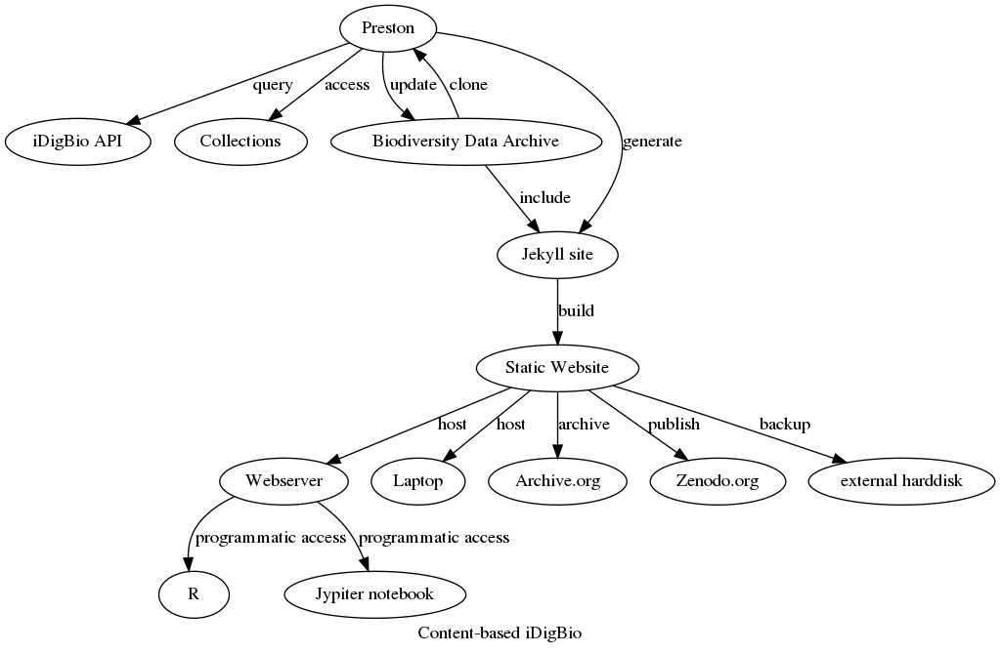



## Welcome to Content-based iDigBio! 

Are you looking for a way to have fast, local access to iDigBio indexed records?

Would you like to have an *exact* copy of the images of your research dataset? 

Would you like to help preserve some (or all) of iDigBio's images and their associated specimen data?

### Introducing Content-based iDigBio.

This automatically generated website contains a versioned archive of a custom selection of specimen records and associated media. The selection is made using the [iDigBio Search API](https://www.idigbio.org/wiki/index.php/IDigBio_API), a powerful search engine powered by Elastic Search that contains over 130M vouchered specimen records. The data is archived using [Preston](https://github.com/bio-guoda/preston), a biodiversity data tracker that can version entire biodiversity dataset networks. Finally, the website is generated from the archived content using [Jekyll](https://jekyllrb.com/), the static site generator that powers GitHub pages. 



### Steps to Archive iDigBio-indexed Content

More specifically, this website was created using:

```
# first, create a new blank jekyll site
jekyll new [site_dir] --blank 

cd [site_dir]

# archive 10 iDigBio indexed Andrenidae records and related images
preston track "https://search.idigbio.org/v2/search/records/?rq=%7B%22family%22%3A%22Andrenidae%22%2c%22hasImage%22%3A%22true%22%7D&limit=10&offset=0" 

# generate Jekyll site for archived content
preston copyTo --type jekyll . 

# launch website and visit http://localhost:4000 in your browser
jekyll s 
``` 

You can clone all the archive data using:

```
mkdir [some dir]
cd [some dir]

# clone the data from this website 
preston clone "{{ "/data" | prepend: site.baseurl | prepend: site.url }}"
```


Also, you can query the idigbio records available through this site via the api at <a href="{{ endpoint }}">{{ endpoint }}</a>. With this, you can programmatically access the data and select the records you are interested in. For instance, you can show the first record by executing: 

```
curl "{{ endpoint }}" | head -n1 | jq .
```

Or, select only records that mention "harvard":

```
curl "{{ endpoint }}" | grep "harvard" | jq . > harvard-records.json
```

This archived dataset includes {{ site.pages | where: "layout", "record" | size }} specimen records and {{ site.pages | where: "layout", "mediarecord" | size }} media records. 

The first 10 records and their associated media included in this archive iDigBio query are:


<div style="display: flex; flex-direction: column; row-gap: 2em;">
  
  
  
  <div style="display: flex; flex-align: column; border: solid;">
    
  </div>
  

</div>
